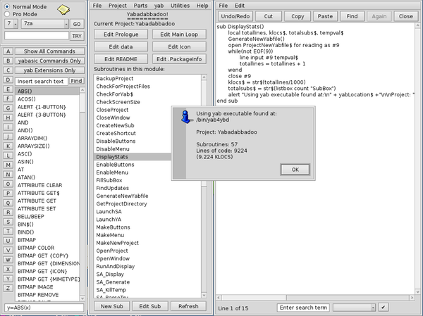

# Yabadabbadoo

by Michel Clasquin-Johnson

Public domain software, written for Haiku in yab using Yabadabbadoo itself (!).

Yabadabbadoo is an alternative IDE for the yab programming language. It structures your subroutines into separate files, which are combined at run/compile time. This makes it easier to write longer programs - for short programs, you might as well use the official yab IDE. In a way, I tried to recreate the UI I recall from my days with QuickBasic.

Beta 4 brings in the following features:

+ Select from a variety of templates to create your new project.
+ Links to yab resources in the Help menu.
+ Removed obsolete Update feature. We have package management now.
+ Limited Github integration - Yabadabbadoo will autodetect if you have installed the separate package 'yabadabbadoo_github_integration'. This is limited to initialising, pushing new changes to and pulling changes from Github. No merges or branching, this is just a way to backup your files, really. To create a new Github project you will have to launch the website.
+ Direct access to the yab BuildFactory (won't work on x86_64 for now, sorry)
+ the libclasqm library is now a dependency. The packaging system should take care of that for you.
+ A fond goodbye to the yab4ybd link. Yabdabbadoo will now warn you if any of your old projects still have this deprecated feature in the shebang line.
+ Updates to the YabAssistant help data, shameslessly stolen from the Official yab IDE
+ Integration with the vstm-gui todo manager (if installed) to let you keep track of your Yabadabbadoo projects.
+ Integration with more text editors (if installed) in the Send 'to ...'. menus.
+ Global search using the TextSearch utility.
+ Global replace in the subs folder using sustituye.
+ Now remembers your project folder and does not default to /boot/home every time you open a new project.

Beta 3 brings in the following features:

+ Use of Workspace 4 is now optional.
+ Works better with screens smaller than 1024x768. The YabAssistant is the last problematic area and even that should work OK if you have at least 600 vertical pixels to play with.
+ Create a desktop shortcut to your project that lets you open it with one double-click. Shortcuts (actually little bash scripts) can be moved and renamed, as long as you don't move or rename the project itself.
+ Open your project in the official yab-IDE, so that you can use the BuildFactory.
+ No longer contains its own version of yab, now that we can specify the official version as a dependency. yab4ybd is retained as a symlink to yab for reasons of backwards compatibility. This may not last forever, so update the first line in any existing Yabadabbadoo programs!

Beta3 is slightly less idiosyncratic than previous versions. But only slightly. It will always be a deeply personal project.

Get it here: https://github.com/clasqm/Yabadabbadoo

Binaries: https://sourceforge.net/p/yabadabbadooforhaiku/

